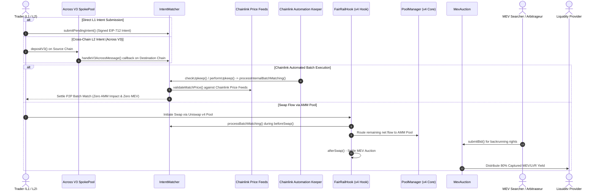

# FairRail

> **Private Intent Matching & LP-Owned MEV Auctions on Uniswap v4**
> 
> *Converting Loss-Versus-Rebalancing (LVR) and MEV from an LP liability into a sustainable liquidity revenue stream.*

[](https://uniswap.org)
[](https://soliditylang.org)
[](https://getfoundry.sh)
[](LICENSE)
[]()

---

## Executive Summary

**FairRail** is a custom **Uniswap v4 Hook** designed for the **Uniswap Hookathon (UHI10)** under the **Sustainable Liquidity and MEV Protection** theme.

In traditional Automated Market Makers (AMMs), liquidity providers (LPs) bear the brunt of **Loss-Versus-Rebalancing (LVR)** and arbitrage leakage—where external searchers extract profit from price latency and block position at the expense of passive LPs. Furthermore, every retail swap directly hits the pool, incurring slippage, gas overhead, and unnecessary MEV exposure.

FairRail solves this by combining three core mechanisms:
1. **Private Intent & Cross-Chain Batch Matching**: Traders on the main chain or across L2s (via **Across Protocol V3**) submit trade intents. Overlapping order flow is matched peer-to-peer off-chain or in-batch before hitting the pool, shielding users from slippage, gas waste, and toxic MEV.
2. **Chainlink Price Safety Guard & Automation**: Batch matches are validated against **Chainlink Data Feeds** to ensure execution rates fall within an acceptable deviation of real-time market prices, preventing toxic fills. **Chainlink Automation Keepers** (`FairRailKeeper`) continuously monitor intent queues to trigger batch settlements hands-free.
3. **LP-Owned MEV Auctions**: Unmatched flow is executed via Uniswap v4. The resulting backrunning and arbitrage opportunities are auctioned to competing searchers via hook lifecycle callbacks (`beforeSwap` / `afterSwap`). **80% of captured auction proceeds are returned directly to pool liquidity providers.**

---

## Deployed & Verified Contracts (Ethereum Sepolia)

All contracts are deployed live on **Ethereum Sepolia Testnet** and verified on Etherscan:

| Contract | Address | Etherscan Link |
| :--- | :--- | :--- |
| **`FairRailHook`** | `0x3a364944a3efbd03566f68d75beed7c7883d00c8` | [](https://sepolia.etherscan.io/address/0x3a364944a3efbd03566f68d75beed7c7883d00c8#code) |
| **`IntentMatcher`** | `0x6d3e48af765e2f3a43a9e09668130a8f718c5c3f` | [](https://sepolia.etherscan.io/address/0x6d3e48af765e2f3a43a9e09668130a8f718c5c3f#code) |
| **`MevAuction`** | `0x303f3d0cbb8527d4511ec62bda09f1f8d5d2bb79` | [](https://sepolia.etherscan.io/address/0x303f3d0cbb8527d4511ec62bda09f1f8d5d2bb79#code) |
| **`FairRailKeeper`** | `0x7355e5f60a90eb7326acfc97b4839833fa5913c0` | [](https://sepolia.etherscan.io/address/0x7355e5f60a90eb7326acfc97b4839833fa5913c0#code) |
| **`PoolManager`** | `0x000000000004444c5dc75cB358380D2e3dE08A90` | Canonical Uniswap v4 PoolManager |

- **Chain ID**: `11155111` (Ethereum Sepolia)
- **Hook Permissions Encoded**: `BEFORE_SWAP` (`0x80`), `AFTER_SWAP` (`0x40`), `BEFORE_SWAP_RETURNS_DELTA` (`0x4000`)

---

## Key Problems Addressed

| Problem | Traditional AMM Impact | FairRail Solution |
| :--- | :--- | :--- |
| **LVR / Toxic Arbitrage** | LPs suffer uncompensated losses to fast block-builders and latency arbitrageurs. | **LP-Owned Auctions** monetize backrunning rights and redirect 80% of MEV value back to LPs. |
| **Unnecessary AMM Volume** | Every small or opposing trade moves the pool reserves, inflating slippage and gas. | **Intent Batching** offsets counter-orders prior to pool execution, minimizing pool impact. |
| **Toxic / Mispriced Fills** | Off-chain matching without price bounds can fill intents at stale or manipulated rates. | **Chainlink Price Feeds** enforce real-time market price safety guards on batch fills. |
| **Cross-Chain Fragmented Liquidity** | L2 users face high bridging latency and slippage when routing trades to mainnet pools. | **Across Protocol V3** enables instant cross-chain intent submission via SpokePool relays. |
| **Manual / Centralized Batch Triggering** | Intent matching relies on centralized bots or manual batch calls. | **Chainlink Automation** (`FairRailKeeper`) decentralizes batch execution monitoring. |

---

## Architecture & Mechanism



---

## Smart Contract Architecture

```
fairrail/
├── contracts/               # Smart Contracts & Foundry Suite
│   ├── src/
│   │   ├── FairRailHook.sol   # Core Uniswap v4 Hook implementing beforeSwap / afterSwap
│   │   ├── IntentMatcher.sol  # Intent verification, Across callback, Chainlink price validation & batch matching engine
│   │   ├── MevAuction.sol     # LP-owned MEV & LVR auction pool
│   │   ├── FairRailKeeper.sol # Chainlink Automation custom upkeep keeper
│   │   └── interfaces/
│   │       ├── AggregatorV3Interface.sol  # Chainlink Data Feed interface
│   │       └── IAcrossMessageHandler.sol  # Across Protocol V3 cross-chain message callback
│   ├── test/
│   │   └── FairRailHook.t.sol # Comprehensive Foundry test suite (68/68 passing)
│   ├── script/
│   │   └── DeployFairRail.s.sol # Hook deployment, salt mining, and Keeper deployment script
│   └── foundry.toml           # Foundry configuration
├── frontend/                # Web3 React + Vite Demo Application
│   ├── src/
│   │   ├── components/        # React Web3 UI components
│   │   └── config/            # ABIs and Sepolia contract addresses
│   ├── package.json
│   ├── vite.config.js
│   └── index.html
├── .gitignore
├── .env
├── LICENSE
└── README.md
```

### Smart Contract Components

#### 1. `FairRailHook.sol`
Implements Uniswap v4 `beforeSwap` and `afterSwap` hooks:
- **`beforeSwap`**: Intercepts swap parameters and queries `IntentMatcher`. If an intent match is detected, net volume is reduced to shield pool reserves.
- **`afterSwap`**: Triggered immediately post-execution. Finalizes searcher bids for the current block and credits 80% of winning bids into the LP revenue pool.

#### 2. `IntentMatcher.sol`
Validates EIP-712 trade intents, handles cross-chain receipts, and enforces oracle price safety:
- **Across V3 Callback**: Implements `AcrossMessageHandler.handleV3AcrossMessage` to receive cross-chain intents bridged via Across SpokePool.
- **Chainlink Price Safety**: Queries Chainlink AggregatorV3 feeds (`validateMatchPrice`) to ensure batch fill rates do not deviate beyond configurable limits (`maxPriceDeviationBps`).
- **P2P & Batch Matching**: Direct P2P intent matching (`matchDirectIntents`), swap-triggered batch matching (`processBatchMatching`), and internal automated batch matching (`processInternalBatchMatching`).
- **Queue Maintenance**: Storage queue compaction (`cleanupPendingIntents`).

#### 3. `FairRailKeeper.sol`
Custom upkeep contract compatible with **Chainlink Automation**:
- **`checkUpkeep`**: Scans registered token pairs off-chain to detect when pending intent queues exceed threshold `minPendingBatchSize`.
- **`performUpkeep`**: Executes `processInternalBatchMatching` on-chain when triggered by Chainlink Automation nodes.

#### 4. `MevAuction.sol`
An on-chain competitive bidding system for searchers:
- **`submitBid(bytes32 poolId)`**: Searchers place ETH bids for backrunning rights on a specific pool.
- **`settleAuction(bytes32 poolId)`**: Called exclusively by `FairRailHook` during `afterSwap` to allocate yield.
- **`withdrawRefund()`**: Pull pattern for outbid searcher refund claims.
- **`withdrawLpRevenue(bytes32 poolId, address to)`**: Withdraws accumulated ETH yield to LPs.

---

## Getting Started

### Prerequisites
- [Foundry](https://getfoundry.sh/) (solc `0.8.26` / `cancun` EVM target)
- Node.js (v18+)
- Git

### Installation

```bash
# Clone repository
git clone https://github.com/morelucks/fairrail.git
cd fairrail
```

### Smart Contracts (Build & Test)

```bash
# Navigate to contracts directory
cd contracts

# Install Foundry dependencies
forge install

# Compile contracts
forge build

# Run full test suite (68/68 passing)
forge test
```

---

## Test Coverage Highlights

The Foundry test suite (`test/FairRailHook.t.sol`) verifies:
- **Hook Permissions**: Ensures `beforeSwap` and `afterSwap` flags are correctly configured.
- **Intent Hashing & Matching**: Validates trade intent signature hashes and P2P counter-order execution.
- **Across Cross-Chain Receipt**: Simulates `handleV3AcrossMessage` callback from Across SpokePool, intent queuing, and cross-chain to local matching.
- **Chainlink Oracle Safety**: Tests price reads from `AggregatorV3Interface`, deviation boundary checks, staleness timeouts, and oracle-gated match rejections.
- **Chainlink Automation Keeper**: Verifies `checkUpkeep` evaluation and `performUpkeep` batch execution.
- **Searcher Bidding & LP Yield Accrual**: Simulates competitive MEV auction bids, refund logic, and 80% revenue split to LPs.
- **Property-Based Fuzz Testing**: Property-based fuzz tests verify auction revenue splits and fill invariants across 256+ random runs.

---

## Gas Benchmark Summary

| Contract | Function | Avg Gas Cost | Median Gas |
| :--- | :--- | :---: | :---: |
| **`IntentMatcher`** | `matchDirectIntents` | 90,678 gas | 42,821 gas |
| **`IntentMatcher`** | `processBatchMatching` | 87,882 gas | 87,880 gas |
| **`IntentMatcher`** | `submitPendingIntent` | 187,542 gas | 277,927 gas |
| **`IntentMatcher`** | `handleV3AcrossMessage` | 208,782 gas | 208,782 gas |
| **`FairRailKeeper`** | `performUpkeep` | 654,017 gas | 654,017 gas |
| **`MevAuction`** | `submitBid` | 92,036 gas | 112,860 gas |
| **`MevAuction`** | `settleAuction` | 61,428 gas | 71,289 gas |
| **`MevAuction`** | `withdrawLpRevenue` | 61,192 gas | 61,192 gas |

---

## Roadmap & Future Architecture

- **Phase 1 (Current - UHI10)**: Core Uniswap v4 Hook implementation, Across V3 cross-chain intent bridge, Chainlink Price Feed safety guards, Chainlink Automation Keeper integration, LP MEV auction pool, and Web3 Demo UI.
- **Phase 2 (FHE Integration)**: Incorporating Fully Homomorphic Encryption (FHE via Inco / Zama) for confidential encrypted intent orderbooks, eliminating frontrunning prior to matching.
- **Phase 3 (EigenLayer AVS)**: Deploying a dedicated Actively Validated Service (AVS) for decentralized off-chain intent batching and searcher execution verification with automated slashing.


---

## Hackathon Submission Details

- **Project Name**: FairRail
- **Hackathon**: Uniswap Hookathon (UHI10)
- **Theme**: Sustainable Liquidity and MEV Protection
- **Author**: Kamshak Lucky Isuwa ([@morelucks](https://github.com/morelucks))
- **Email**: `luckykamshak@gmail.com`
- **Team**: Solo

---

## License

This project is licensed under the [MIT License](LICENSE).
