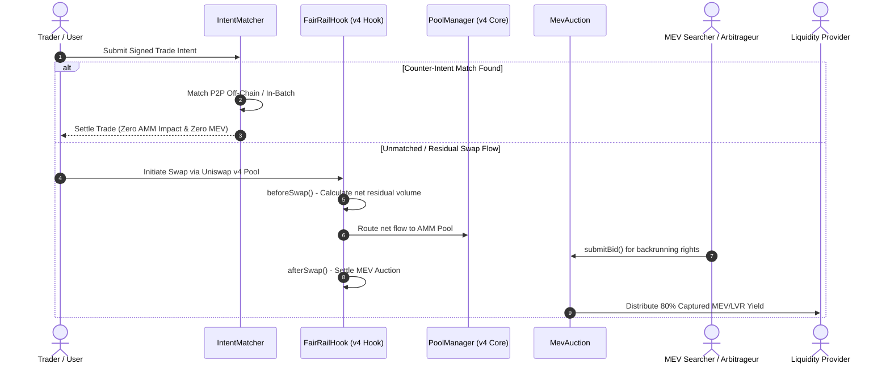

# 🚆 FairRail

> **Private Intent Matching & LP-Owned MEV Auctions on Uniswap v4**
> 
> *Turning MEV from an LP liability into a sustainable LP revenue stream.*

[](https://uniswap.org)
[](https://soliditylang.org)
[](https://getfoundry.sh)
[](LICENSE)
[]()

---

## 💡 Executive Summary

**FairRail** is a custom **Uniswap v4 Hook** designed for the **Uniswap Hookathon (UHI10)** under the **Sustainable Liquidity and MEV Protection** theme.

In traditional AMMs, liquidity providers (LPs) bear the brunt of **Loss-Versus-Rebalancing (LVR)** and arbitrage leakage—where external searchers extract profit from price latency and block position at the expense of passive LPs. Furthermore, every retail swap directly hits the pool, incurring slippage, gas overhead, and unnecessary MEV exposure.

FairRail solves this by combining two complementary mechanisms:
1. **Private Intent Batch Matching**: Before routing trades directly to the AMM, FairRail checks for compatible counter-intents. Overlapping order flow is matched off-chain/in-batch, shielding users from slippage, gas waste, and toxic MEV.
2. **LP-Owned MEV Auctions**: Unmatched flow is executed via Uniswap v4. The resulting backrunning and arbitrage opportunities are auctioned to competing searchers via hook lifecycle callbacks (`beforeSwap` / `afterSwap`). **80% of captured auction proceeds are returned directly to pool liquidity providers.**

---

## 🌐 Deployed & Verified Contracts (Ethereum Sepolia)

All contracts are deployed live on **Ethereum Sepolia Testnet** and **100% verified** on Etherscan:

| Contract | Address | Etherscan Link |
| :--- | :--- | :--- |
| 🪝 **`FairRailHook`** | `0x7f18f2f796ed2beb1c5ff625fa9d3280cd4940c8` | [](https://sepolia.etherscan.io/address/0x7f18f2f796ed2beb1c5ff625fa9d3280cd4940c8#code) |
| 📜 **`IntentMatcher`** | `0x88b222cc2c5ab1d5a67379c44a6bcca80be9e829` | [](https://sepolia.etherscan.io/address/0x88b222cc2c5ab1d5a67379c44a6bcca80be9e829#code) |
| ⚡ **`MevAuction`** | `0x08c8ababe136a66e10d5c20f6553f9726284343c` | [](https://sepolia.etherscan.io/address/0x08c8ababe136a66e10d5c20f6553f9726284343c#code) |
| 🦄 **`PoolManager`** | `0x000000000004444c5dc75cB358380D2e3dE08A90` | Canonical Uniswap v4 PoolManager |

- **Chain ID**: `11155111` (Ethereum Sepolia)
- **Hook Permissions Encoded**: `BEFORE_SWAP` (`0x80`), `AFTER_SWAP` (`0x40`), `BEFORE_SWAP_RETURNS_DELTA` (`0x4000`)

---

## 🎯 Key Problems Addressed

| Problem | Traditional AMM Impact | FairRail Solution |
| :--- | :--- | :--- |
| **LVR / Toxic Arbitrage** | LPs suffer uncompensated losses to fast block-builders and latency arbitrageurs. | **LP-Owned Auctions** monetize backrunning rights and redirect 80% of MEV value back to LPs. |
| **Unnecessary AMM Volume** | Every small or opposing trade moves the pool reserves, inflating slippage and gas. | **Intent Batching** offsets counter-orders prior to pool execution, minimizing pool impact. |
| **MEV Exposure** | Public mempool swaps are vulnerable to frontrunning and sandwich attacks. | **Private Intent Matching** hides intent details until batch settlement. |

---

## 🏗️ Architecture & Mechanism



---

## 🧩 Smart Contract Architecture

```
fairrail/
├── src/
│   ├── FairRailHook.sol   # Core Uniswap v4 Hook implementing beforeSwap / afterSwap
│   ├── IntentMatcher.sol  # Off-chain intent verification & batch matching engine
│   └── MevAuction.sol     # LP-owned MEV & LVR auction pool
├── test/
│   └── FairRailHook.t.sol # Comprehensive Foundry test suite
├── script/
│   └── DeployFairRail.s.sol # Hook deployment & address mining script
├── foundry.toml           # Foundry configuration
└── LICENSE                # MIT License
```

### 1. `FairRailHook.sol`
Implements Uniswap v4 `beforeSwap` and `afterSwap` hooks:
- **`beforeSwap`**: Intercepts swap parameters and queries `IntentMatcher`. If an intent match is detected, net volume is reduced to shield pool reserves.
- **`afterSwap`**: Triggered immediately post-execution. Finalizes searcher bids for the current block and credits 80% of winning bids into the LP revenue pool.

### 2. `IntentMatcher.sol`
Validates EIP-712 / custom signed trade intents:
- Direct P2P intent matching (`matchDirectIntents`).
- Batch matching simulation (`processBatchMatching`) returning matched volume vs residual AMM flow.

### 3. `MevAuction.sol`
An on-chain competitive bidding system for searchers:
- `submitBid(bytes32 poolId)`: Searchers place ETH bids for backrunning rights on a specific pool.
- `settleAuction(bytes32 poolId)`: Called exclusively by `FairRailHook` during `afterSwap` to allocate yield.

---

## ⚡ Getting Started

### Prerequisites
- [Foundry](https://getfoundry.sh/) (solc `0.8.26` / `cancun` EVM target)
- Git

### Installation & Setup

```bash
# Clone repository
git clone https://github.com/morelucks/fairrail.git
cd fairrail

# Install dependencies
forge install
```

### Build & Test

```bash
# Compile smart contracts
forge build

# Run unit and integration tests
forge test

# Run tests with detailed trace
forge test -vvvv
```

---

## 🔬 Test Coverage Highlights

The Foundry test suite (`test/FairRailHook.t.sol`) verifies:
- ✅ **Hook Permissions**: Ensures `beforeSwap` and `afterSwap` flags are correctly configured.
- ✅ **Intent Hashing & Matching**: Validates trade intent signature hashes and P2P counter-order execution.
- ✅ **Batch Matching Simulation**: Tests net volume calculation when routing unmatched trade portions to AMM.
- ✅ **Searcher Bidding**: Simulates competitive MEV auction bids and validates refund logic for outbid searchers.
- ✅ **LP Yield Accrual**: Verifies that 80% of winning auction bids are credited to LPs upon `afterSwap`.

---

## 🗺️ Roadmap & Future Architecture

- **Phase 1 (Current - UHI10)**: Core Uniswap v4 Hook implementation, batch intent matcher simulation, and LP MEV auction engine.
- **Phase 2 (FHE Integration)**: Incorporating Fully Homomorphic Encryption (FHE via Inco / Zama) for confidential encrypted intent orderbooks, eliminating frontrunning prior to matching.
- **Phase 3 (EigenLayer AVS)**: Deploying a dedicated Actively Validated Service (AVS) for decentralized off-chain intent batching and searcher execution verification with automated slashing.

---

## 📋 Hackathon Submission Details

- **Project Name**: FairRail
- **Hackathon**: Uniswap Hookathon (UHI10)
- **Theme**: Sustainable Liquidity and MEV Protection
- **Author**: Kamshak Lucky Isuwa ([@morelucks](https://github.com/morelucks))
- **Email**: `luckykamshak@gmail.com`
- **Team**: Solo

---

## 📜 License

This project is licensed under the [MIT License](LICENSE).
