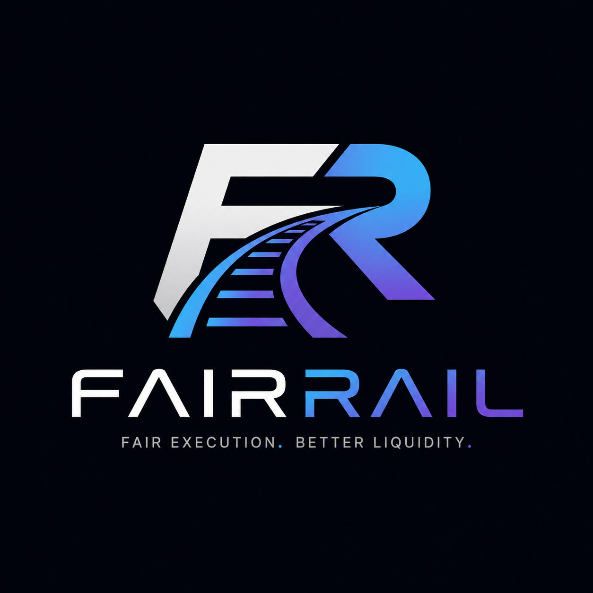
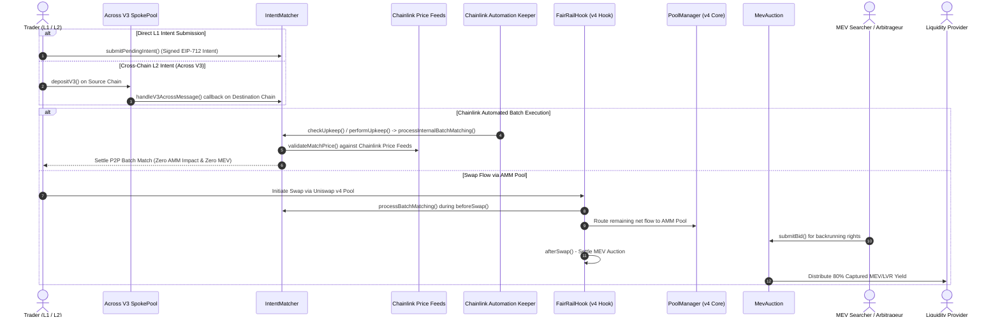

<p align="center">
  
</p>

<h1 align="center">FairRail</h1>

<p align="center">
  <strong>Private Intent Matching & LP-Owned MEV Auctions on Uniswap v4</strong>
</p>

<p align="center">
  <em>Converting Loss-Versus-Rebalancing (LVR) and MEV from an LP liability into a sustainable liquidity revenue stream.</em>
</p>

<p align="center">
  <a href="https://uniswap.org"></a>
  <a href="https://soliditylang.org"></a>
  <a href="https://getfoundry.sh"></a>
  <a href="LICENSE"></a>
</p>

<p align="center">
  <a href="#"></a>
  <a href="https://chain.link"></a>
  <a href="https://across.to"></a>
</p>

<p align="center">
  
  
  
</p>

---

## Table of Contents

- [Executive Summary](#executive-summary)
- [The Problem](#the-problem)
- [How FairRail Works](#how-fairrail-works)
- [Architecture](#architecture)
- [Smart Contracts](#smart-contracts)
- [Partner Integrations](#partner-integrations)
- [Deployed Contracts](#deployed--verified-contracts)
- [Getting Started](#getting-started)
- [Test Suite](#test-suite)
- [Gas Benchmarks](#gas-benchmarks)
- [Frontend DApp](#frontend-dapp)
- [Roadmap](#roadmap)
- [Hackathon Submission](#hackathon-submission)
- [License](#license)

---

## Executive Summary

**FairRail** is a Uniswap v4 Hook built for the **Uniswap Hookathon (UHI10)** under the **Sustainable Liquidity & MEV Protection** theme.

Today, liquidity providers (LPs) on AMMs suffer from **Loss-Versus-Rebalancing (LVR)** — a systemic loss caused by arbitrageurs exploiting stale pool prices. Simultaneously, retail traders are exposed to **sandwich attacks**, **frontrunning**, and **unnecessary slippage** from directly interacting with the pool.

**FairRail flips the MEV equation**: instead of external searchers extracting value from LPs and traders, FairRail captures MEV on-chain and returns **80% of auction proceeds directly to liquidity providers**, turning LVR from a loss into a revenue stream.

### Core Mechanisms

| # | Mechanism | What It Does |
|---|-----------|-------------|
| 1 | **Private Intent Matching** | Traders submit EIP-712 signed intents. Overlapping orders are matched peer-to-peer *before* hitting the pool — zero slippage, zero MEV. |
| 2 | **Cross-Chain Intent Bridge** | L2 users submit intents via **Across Protocol V3** `depositV3()` → relayed to the hook's `IntentMatcher` on the destination chain. |
| 3 | **Chainlink Price Safety** | Every batch match is validated against **Chainlink Data Feeds** to prevent toxic fills at manipulated prices. |
| 4 | **Automated Batch Settlement** | **Chainlink Automation** keepers monitor intent queues and trigger batch matching hands-free — fully decentralized. |
| 5 | **LP-Owned MEV Auctions** | Unmatched flow goes through the AMM. Backrunning rights are auctioned to competing searchers via `afterSwap` — **80% of proceeds go to LPs**. |

---

## The Problem

```
                    ┌──────────────────────────────────────────────────┐
                    │          CURRENT AMM LANDSCAPE                   │
                    │                                                  │
                    │   Trader ──swap──► AMM Pool                      │
                    │                      │                           │
                    │     Sandwiched ◄─────┤──────► LVR Losses         │
                    │     Frontrun   ◄─────┤──────► Toxic Arb          │
                    │     Slippage   ◄─────┘──────► LP Value Leakage   │
                    │                                                  │
                    │   Winners: External MEV Searchers & Block Builders│
                    │   Losers:  LPs + Retail Traders                  │
                    └──────────────────────────────────────────────────┘
```

| Problem | Traditional AMM Impact | FairRail Solution |
| :--- | :--- | :--- |
| **LVR / Toxic Arbitrage** | LPs suffer uncompensated losses to fast block-builders and latency arbitrageurs | **LP-Owned Auctions** monetize backrunning rights; 80% of captured MEV flows back to LPs |
| **Unnecessary AMM Volume** | Every opposing trade moves pool reserves, inflating slippage and gas | **Intent Batching** offsets counter-orders before pool execution, minimizing pool impact |
| **Toxic / Mispriced Fills** | Off-chain matching without price bounds can fill at stale or manipulated rates | **Chainlink Price Feeds** enforce real-time market price safety guards on every batch fill |
| **Cross-Chain Fragmented Liquidity** | L2 users face high bridging latency and slippage routing trades to mainnet pools | **Across Protocol V3** enables instant cross-chain intent submission via SpokePool relays |
| **Manual Batch Triggering** | Intent matching relies on centralized bots or manual calls | **Chainlink Automation** (`FairRailKeeper`) decentralizes batch execution monitoring |

---

## How FairRail Works

```
┌─────────────────────────────────────────────────────────────────────┐
│                        FairRail Flow                                │
│                                                                     │
│  1. Trader signs EIP-712 intent     ──►  IntentMatcher              │
│     (or L2 user via Across V3)           │                          │
│                                          │                          │
│  2. Chainlink Automation Keeper    ──►   │ checkUpkeep()            │
│     monitors intent queue                │ performUpkeep()          │
│                                          │                          │
│  3. Counter-intents matched P2P    ──►   │ processBatchMatching()   │
│     (validated via Chainlink Oracle)     │ validateMatchPrice()     │
│                                          ▼                          │
│  4. Matched? ─── YES ──► P2P Settlement (Zero AMM Impact!)         │
│                │                                                    │
│                NO                                                   │
│                │                                                    │
│  5. Unmatched flow ──► Uniswap v4 beforeSwap() ──► AMM Pool        │
│                                                        │            │
│  6. Searchers bid for backrunning  ──► MevAuction.submitBid()       │
│                                                        │            │
│  7. afterSwap() settles auction    ──► 80% to LPs                   │
│                                        20% protocol treasury        │
└─────────────────────────────────────────────────────────────────────┘
```

---

## Architecture



---

## Smart Contracts

### Project Structure

```
fairrail/
├── contracts/                     # Foundry Smart Contract Suite
│   ├── src/
│   │   ├── FairRailHook.sol         # Core Uniswap v4 Hook (beforeSwap + afterSwap)
│   │   ├── IntentMatcher.sol        # EIP-712 intent engine, Across V3 callback, Chainlink oracle validation
│   │   ├── MevAuction.sol           # LP-owned MEV & LVR auction system
│   │   ├── FairRailKeeper.sol       # Chainlink Automation custom upkeep keeper
│   │   └── interfaces/
│   │       ├── AggregatorV3Interface.sol   # Chainlink Data Feed interface
│   │       └── IAcrossMessageHandler.sol   # Across Protocol V3 cross-chain callback
│   ├── test/
│   │   └── FairRailHook.t.sol       # Comprehensive test suite (68/68 passing)
│   ├── script/
│   │   ├── DeployFairRail.s.sol     # Production deployment with CREATE2 salt mining
│   │   └── DemoFairRail.s.sol       # Pro demo script — full protocol lifecycle
│   └── foundry.toml                 # Foundry config (solc 0.8.26, cancun EVM)
├── frontend/                      # React + Vite Web3 DApp
│   ├── src/
│   │   ├── App.jsx                  # Main application with tab-based navigation
│   │   ├── components/
│   │   │   ├── Header.jsx           # Navigation & wallet connection
│   │   │   ├── LandingHero.jsx      # Landing page with protocol overview
│   │   │   ├── TraderPortal.jsx     # Intent submission & EIP-712 signing UI
│   │   │   ├── IntentQueue.jsx      # Live intent queue viewer
│   │   │   ├── MevAuctionPortal.jsx # Searcher bidding interface
│   │   │   ├── LpDashboard.jsx      # LP revenue tracking & claims
│   │   │   └── KeeperPanel.jsx      # Chainlink Automation status dashboard
│   │   ├── config/
│   │   │   └── contracts.js         # ABI + deployed contract addresses
│   │   └── index.css                # Design system & styling
│   ├── index.html
│   ├── vite.config.js
│   └── package.json
├── VIDEO_SCRIPT.md                # Demo video recording guide
├── README.md
├── LICENSE (MIT)
└── .gitignore
```

### Contract Breakdown

#### `FairRailHook.sol` — Core Uniswap v4 Hook

The central hook implementing `beforeSwap` and `afterSwap` lifecycle callbacks:

| Callback | Function | Description |
|----------|----------|-------------|
| `beforeSwap` | Intent interception | Queries `IntentMatcher` for matching counter-orders. Matched volume is settled P2P; only the *net unmatched* flow reaches the AMM pool. Returns a `BeforeSwapDelta` to reduce the swap amount. |
| `afterSwap` | MEV auction settlement | Calls `MevAuction.settleAuction()` to finalize the highest searcher bid. Distributes 80% of proceeds to the LP revenue pool. |

**Hook Permissions**: `BEFORE_SWAP` · `AFTER_SWAP` · `BEFORE_SWAP_RETURNS_DELTA`

#### `IntentMatcher.sol` — Intent Engine (737 LOC)

The largest contract, handling the full intent lifecycle:

- **EIP-712 Structured Signing**: Intents are signed off-chain with typed data (`TradeIntent` struct) and verified on-chain with `ecrecover`. Replay protection via per-address nonces.
- **Across Protocol V3 Integration**: Implements `AcrossMessageHandler.handleV3AcrossMessage` to receive cross-chain intents relayed via Across SpokePool. Cross-chain intents are automatically queued for matching.
- **Chainlink Price Validation**: `validateMatchPrice()` queries `AggregatorV3Interface` feeds to ensure fill rates don't deviate beyond `maxPriceDeviationBps` from the oracle's latest answer. Staleness protection via `maxPriceStaleness`.
- **Matching Engine**: Three matching modes:
  1. `matchDirectIntents()` — Direct P2P match between two compatible intents
  2. `processBatchMatching()` — Hook-triggered batch matching during `beforeSwap`
  3. `processInternalBatchMatching()` — Keeper-triggered autonomous batch matching
- **Queue Management**: `cleanupPendingIntents()` compacts the storage queue to reclaim gas.

#### `FairRailKeeper.sol` — Chainlink Automation Keeper

Custom upkeep contract compatible with **Chainlink Automation v2.1**:

| Function | Type | Description |
|----------|------|-------------|
| `checkUpkeep()` | Off-chain | Scans registered token pairs to detect when pending queues exceed `minPendingBatchSize` |
| `performUpkeep()` | On-chain | Executes `processInternalBatchMatching` when triggered by Chainlink Automation nodes |
| `registerPair()` | Admin | Registers new token pairs for automated monitoring |
| `removePair()` | Admin | Removes token pairs from monitoring |

#### `MevAuction.sol` — LP-Owned MEV Auction

Competitive on-chain bidding system for searchers:

| Function | Description |
|----------|-------------|
| `submitBid(bytes32 poolId)` | Searchers place ETH bids for backrunning rights on a specific pool |
| `settleAuction(bytes32 poolId)` | Called exclusively by `FairRailHook` during `afterSwap` — splits proceeds 80/20 |
| `withdrawRefund()` | Pull pattern for outbid searcher refund claims |
| `withdrawLpRevenue(bytes32 poolId, address to)` | Withdraws accumulated ETH yield to LP recipients |

---

## Partner Integrations

### Chainlink — Oracle & Automation

FairRail integrates **two** Chainlink products:

1. **Chainlink Data Feeds** — Every batch match is validated against real-time oracle prices via `AggregatorV3Interface`. Configurable deviation tolerance (`maxPriceDeviationBps`) and staleness bounds (`maxPriceStaleness`) ensure no toxic fills.

2. **Chainlink Automation** — The `FairRailKeeper` contract is registered as a **Custom Logic** upkeep on [automation.chain.link](https://automation.chain.link). Automation nodes call `checkUpkeep()` off-chain to scan intent queues, then execute `performUpkeep()` on-chain when thresholds are met — fully decentralized, no centralized bots.

### Across Protocol V3 — Cross-Chain Intent Bridge

FairRail extends intent matching to **any Across-connected L2/L3**:

1. An L2 trader calls `depositV3()` on their source chain's SpokePool with the intent payload encoded in the `message` field.
2. Across relayers bridge the message to the destination chain.
3. `IntentMatcher.handleV3AcrossMessage()` decodes the intent and adds it to the pending queue.
4. Cross-chain intents are matched against local intents during the next batch cycle.

This eliminates the need for L2 users to bridge tokens manually, reducing latency and gas costs.

---

## Deployed & Verified Contracts

All contracts are deployed live on **Ethereum Sepolia Testnet** and verified on Etherscan:

| Contract | Address | Status |
| :--- | :--- | :---: |
| **`FairRailHook`** | [`0x3a364944...883d00c8`](https://sepolia.etherscan.io/address/0x3a364944a3efbd03566f68d75beed7c7883d00c8#code) | Verified |
| **`IntentMatcher`** | [`0x6d3e48af...18c5c3f`](https://sepolia.etherscan.io/address/0x6d3e48af765e2f3a43a9e09668130a8f718c5c3f#code) | Verified |
| **`MevAuction`** | [`0x303f3d0c...d2bb79`](https://sepolia.etherscan.io/address/0x303f3d0cbb8527d4511ec62bda09f1f8d5d2bb79#code) | Verified |
| **`FairRailKeeper`** | [`0x7355e5f6...fa5913c0`](https://sepolia.etherscan.io/address/0x7355e5f60a90eb7326acfc97b4839833fa5913c0#code) | Verified |
| **`PoolManager`** | [`0x00000000...e08A90`](https://sepolia.etherscan.io/address/0x000000000004444c5dc75cB358380D2e3dE08A90) | Canonical Uniswap v4 |

> **Chain**: Ethereum Sepolia (Chain ID `11155111`)
>
> **Hook Permissions**: `BEFORE_SWAP` (`0x80`) · `AFTER_SWAP` (`0x40`) · `BEFORE_SWAP_RETURNS_DELTA` (`0x4000`)

---

## Getting Started

### Prerequisites

| Tool | Version | Purpose |
|------|---------|---------|
| [Foundry](https://getfoundry.sh/) | Latest | Solidity toolchain (solc 0.8.26, cancun EVM) |
| [Node.js](https://nodejs.org/) | v18+ | Frontend dev server |
| [Git](https://git-scm.com/) | Latest | Version control |

### Installation

```bash
# Clone the repository
git clone https://github.com/morelucks/fairrail.git
cd fairrail
```

### Build & Test Smart Contracts

```bash
cd contracts

# Install Foundry dependencies (Uniswap v4 core, periphery, OpenZeppelin)
forge install

# Compile all contracts
forge build

# Run the full test suite (68/68 tests passing)
forge test

# Run with verbosity for detailed traces
forge test -vvv

# Run the Pro Demo Script (full protocol lifecycle walkthrough)
forge script script/DemoFairRail.s.sol:DemoFairRail -vv
```

### Run the Frontend DApp

```bash
cd frontend

# Install dependencies
npm install

# Start the development server
npm run dev
```

### Deploy to Sepolia

```bash
cd contracts

# Set environment variables
export PRIVATE_KEY=<your_private_key>
export ETHERSCAN_API_KEY=<your_etherscan_key>

# Deploy and verify on Sepolia
forge script script/DeployFairRail.s.sol:DeployFairRail \
  --rpc-url https://rpc.sepolia.org \
  --broadcast \
  --verify \
  -vvvv
```

---

## Test Suite

The test suite (`test/FairRailHook.t.sol`) provides **68 passing tests** covering every aspect of the protocol:

```
Suite result: ok. 68 passed; 0 failed; 0 skipped
Finished in 678.19ms (1.56s CPU time)
```

### Test Categories

| Category | Tests | What's Verified |
|----------|:-----:|-----------------|
| **Hook Lifecycle** | 6 | `beforeSwap` / `afterSwap` callback execution, permission flags, unauthorized access reverts |
| **EIP-712 Intent Signing** | 8 | Digest determinism, typehash correctness, signature verification, nonce increments, replay prevention |
| **P2P & Batch Matching** | 6 | Direct intent matching, batch simulation, multi-counter-intent batches, cleanup |
| **Across V3 Cross-Chain** | 4 | `handleV3AcrossMessage` callback, cross-chain → local matching, expiry, unauthorized sender |
| **Chainlink Oracle** | 6 | Price feed reads, deviation bounds, staleness timeouts, oracle-gated rejections, no-feed passthrough |
| **Chainlink Keeper** | 5 | `checkUpkeep` evaluation, `performUpkeep` execution, pair registration/removal |
| **MEV Auction** | 8 | Bid submission, outbid refunds (pull pattern), auction settlement, LP revenue withdrawal, zero-bid reverts |
| **LP Revenue** | 4 | Revenue accrual, claim mechanics, double-claim reverts, treasury withdrawal |
| **Access Control** | 7 | Ownership transfer, unauthorized reverts across all admin functions |
| **Property-Based Fuzz** | 2 | `testFuzz_DirectIntentMatchingAmounts` (256 runs), `testFuzz_MevAuctionBiddingSplit` (256 runs) |
| **Edge Cases** | 12 | Expired intents, empty signatures, incompatible tokens, invalid nonces, bad signatures |

---

## Gas Benchmarks

| Contract | Function | Avg Gas | Median Gas |
| :--- | :--- | :---: | :---: |
| `IntentMatcher` | `matchDirectIntents` | 90,678 | 42,821 |
| `IntentMatcher` | `processBatchMatching` | 87,882 | 87,880 |
| `IntentMatcher` | `submitPendingIntent` | 187,542 | 277,927 |
| `IntentMatcher` | `handleV3AcrossMessage` | 208,782 | 208,782 |
| `FairRailKeeper` | `performUpkeep` | 654,017 | 654,017 |
| `MevAuction` | `submitBid` | 92,036 | 112,860 |
| `MevAuction` | `settleAuction` | 61,428 | 71,289 |
| `MevAuction` | `withdrawLpRevenue` | 61,192 | 61,192 |
| `FairRailHook` | `beforeSwap` (with match) | ~359,199 | — |
| `FairRailHook` | `afterSwap` (with auction) | ~158,958 | — |

---

## Frontend DApp

The frontend is a **React + Vite** Web3 application providing a visual interface for all protocol interactions:

| Tab | Component | Functionality |
|-----|-----------|--------------|
| **Home** | `LandingHero` | Protocol overview, feature showcase, and animated statistics |
| **Trader Portal** | `TraderPortal` | Submit EIP-712 signed trade intents, view execution status |
| **Intent Queue** | `IntentQueue` | Real-time view of pending intents across token pairs |
| **MEV Auction** | `MevAuctionPortal` | Searcher bidding interface with live auction state |
| **LP Dashboard** | `LpDashboard` | Track accumulated MEV revenue, claim yields, view pool metrics |
| **Keeper** | `KeeperPanel` | Chainlink Automation status, registered pairs, upkeep history |

**Tech Stack**: React 18 · Vite · ethers.js · Vanilla CSS with glassmorphism design

---

## Roadmap

```
Phase 1 (Current — UHI10)          Phase 2 (Next)              Phase 3 (Future)
━━━━━━━━━━━━━━━━━━━━━━━━━━━━━━━━━━━━━━━━━━━━━━━━━━━━━━━━━━━━━━━━━━━━━━━━━━━━━━
[x] Uniswap v4 Hook (beforeSwap    [ ] FHE Encrypted Intent      [ ] EigenLayer AVS for
    + afterSwap)                        Orderbook (Inco/Zama)         decentralized off-chain
[x] EIP-712 Intent Matching        [ ] Confidential batch             intent batching
[x] Across V3 Cross-Chain Bridge        matching — eliminate      [ ] Automated slashing for
[x] Chainlink Price Feed Safety         frontrunning prior to         searcher execution
[x] Chainlink Automation Keeper         settlement                    verification
[x] LP-Owned MEV Auction (80/20)   [ ] Multi-pool intent         [ ] Multi-chain deployment
[x] Web3 React DApp                     aggregation                   (Optimism, Arbitrum, Base)
[x] 68/68 Tests Passing
[x] Sepolia Deployment & Verification
```

---

## Hackathon Submission

| Field | Details |
|-------|---------|
| **Project Name** | FairRail |
| **Project ID** | HK-UHI10-1068 |
| **Hackathon** | Uniswap Hookathon (UHI10) |
| **Theme** | Sustainable Liquidity & MEV Protection |
| **Author** | Kamshak Lucky Isuwa |
| **GitHub** | [@morelucks](https://github.com/morelucks) |
| **X/Twitter** | [@morelucks](https://x.com/morelucks) |
| **Email** | luckykamshak@gmail.com |
| **Team** | Solo |
| **Submission Type** | Hook |

### Partner Integrations

- **Chainlink** — Data Feeds (AggregatorV3Interface) + Automation (Custom Logic Keeper)
- **Across Protocol** — V3 Cross-Chain Intent Bridge (SpokePool + AcrossMessageHandler)

---

## License

This project is licensed under the [MIT License](LICENSE).

---

<p align="center">
  <strong>Built for the Uniswap Hookathon (UHI10)</strong>
  <br />
  <em>Making DeFi fair, one rail at a time.</em>
</p>
